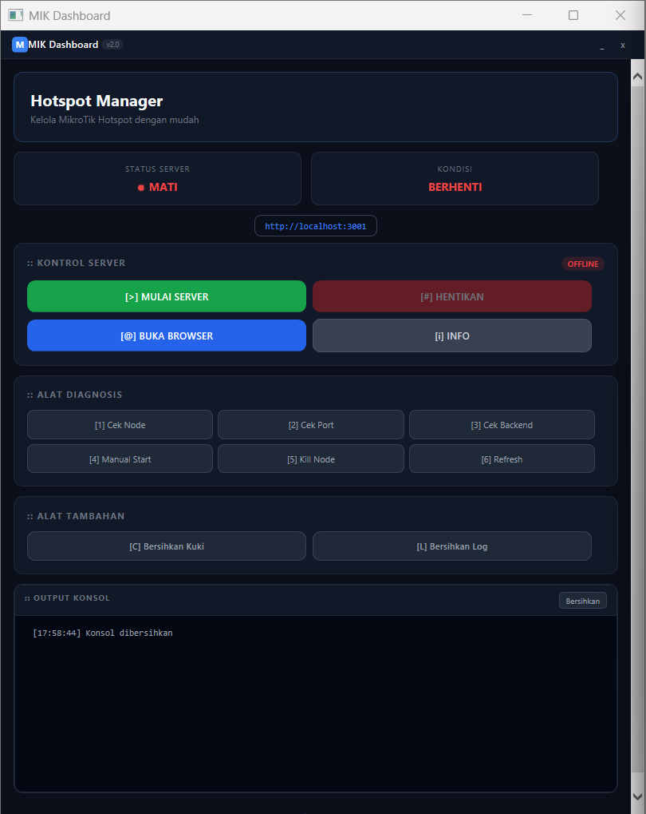
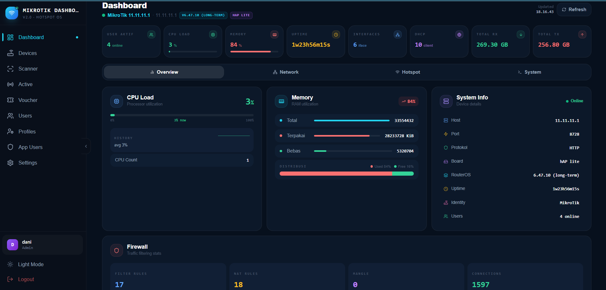

# MIK Dashboard v2.0


**Hotspot Manager untuk MikroTik**

Generate voucher, monitoring user, dan manajemen hotspot — semua dalam satu dashboard.

---

## Screenshots

| HTA Launcher | Dashboard |
|:------------:|:---------:|
|  |  |

---

## Fitur

| Modul | Keterangan |
|-------|-----------|
| Voucher Generator | Generate voucher otomatis dengan prefix, profile, dan limit |
| User Management | CRUD user hotspot MikroTik via API |
| Active Monitoring | Real-time monitoring user yang sedang aktif |
| Profile Manager | Atur bandwidth limit, shared users, session timeout |
| Device Manager | Multi-device MikroTik support |
| Print Voucher | Cetak voucher langsung ke printer |

---

## Tech Stack

```
┌─────────────────┐     ┌─────────────────┐     ┌─────────────────┐
│   HTA Launcher  │────▶│  Node.js API    │────▶│  React Frontend │
│  (Windows GUI)  │     │  Express + JWT  │     │  Tailwind CSS   │
└─────────────────┘     └─────────────────┘     └─────────────────┘
        │                       │                       │
        └───────────────────────┴───────────────────────┘
                              │
                    ┌─────────▼──────────┐
                    │      SQLite        │
                    │  (Local Database)  │
                    └────────────────────┘
```

---

## Prerequisites

- Windows 10/11
- Node.js v18+
- Git (optional)

---

## Cara Install

### 1. Clone Repository

```bash
git clone https://github.com/dani/mik-dashboard.git
cd mik-dashboard
```

### 2. Install Backend

```bash
cd backend
npm install
cd ..
```

### 3. Install & Build Frontend

```bash
cd frontend
npm install
npm run build
cd ..
```

---

## Cara Pakai

### Mode 1: HTA Launcher (Recommended)

1. Double-click `MIK-Dashboard.hta`
2. Klik tombol **[>] MULAI SERVER**
3. Tunggu status **"BERJALAN"**
4. Klik **[@] BUKA BROWSER**
5. Login dengan default credentials

### Mode 2: Manual (Command Line)

```bash
cd backend
node server.js
```

Buka browser: http://localhost:3001

---

## Default Login

| Field | Value |
|-------|-------|
| Username | `admin` |
| Password | `admin123` |

---

## Struktur Folder

```
mik-dashboard/
├── MIK-Dashboard.hta       # Windows HTA Launcher
├── backend/
│   ├── server.js            # Entry point
│   ├── db.js                # SQLite connection
│   ├── auth.js              # Authentication routes
│   ├── db-clean.js          # Reset database script
│   ├── package.json
│   ├── middleware/
│   │   └── auth.js          # JWT middleware
│   ├── routes/
│   │   ├── devices.js
│   │   ├── hotspot.js
│   │   ├── scan.js
│   │   ├── settings.js
│   │   └── appUsers.js
│   └── data.db              # SQLite database (auto-generated)
├── frontend/
│   ├── index.html
│   ├── vite.config.js
│   ├── package.json
│   ├── src/
│   │   ├── App.jsx
│   │   ├── api.js
│   │   ├── components/
│   │   └── pages/
│   └── dist/                # Build output (auto-generated)
└── README.md
```

---

## API Endpoints

| Method | Endpoint | Keterangan |
|--------|----------|-----------|
| POST | `/api/auth/login` | Login, return JWT |
| GET | `/api/auth/me` | Get current user |
| POST | `/api/auth/register` | Register user (admin only) |
| GET | `/api/devices` | List semua device |
| GET | `/api/devices/:id/hotspot/stats` | Statistik hotspot |
| GET | `/api/devices/:id/hotspot/users` | List user hotspot |
| POST | `/api/devices/:id/hotspot/users` | Tambah user baru |
| DELETE | `/api/devices/:id/hotspot/users/:uid` | Hapus user |
| GET | `/api/devices/:id/hotspot/active` | User aktif |
| GET | `/api/devices/:id/hotspot/vouchers` | List voucher |
| POST | `/api/devices/:id/hotspot/vouchers/generate` | Generate voucher |
| GET | `/api/settings` | Get app settings |
| POST | `/api/settings` | Update settings |
| GET | `/api/health` | Health check |

---

## Troubleshooting

| Masalah | Solusi |
|---------|--------|
| Port 3001 sudah digunakan | Klik **[5] Kill Node** di HTA, atau `taskkill /f /im node.exe` |
| Backend folder not found | Pastikan folder `backend` ada di sebelah `MIK-Dashboard.hta` |
| npm install gagal | Cek Node.js terinstall: `node --version` |
| Browser tidak bisa dibuka | Buka manual: http://localhost:3001 |
| Status stuck "BERJALAN" | Klik **[#] HENTIKAN** atau restart HTA |
| Login gagal | Default: `admin` / `admin123` |

---

## Zero Data Policy

Repository ini **tidak menyimpan data user atau database**. File `.gitignore` otomatis mengecualikan:

- `*.db` — SQLite database
- `node_modules/` — Dependencies
- `.env` — Environment variables
- `*.log` — Log files

Setiap clone/install baru akan generate database kosong dengan default login:

- **Username:** `admin`
- **Password:** `admin123`

Untuk reset database:

```bash
cd backend
node db-clean.js
```

Atau hapus manual: `backend/data.db`

---

## Changelog

### v2.0 (2024-06)

- Redesign UI/UX total
- Tambah HTA launcher dengan polling status
- Fix auto-start bug pada refresh
- Tambah tombol **"Bersihkan Kuki"**
- Support kill by PID + port scanning
- Default login: `admin` / `admin123`

### v1.0 (2024-05)

- Initial release
- Basic voucher generation
- MikroTik API integration

---

## License

MIT License — bebas dipakai, diubah, dan didistribusikan.

Dibuat dengan ❤️ oleh [@dani](https://github.com/daniadz88)
